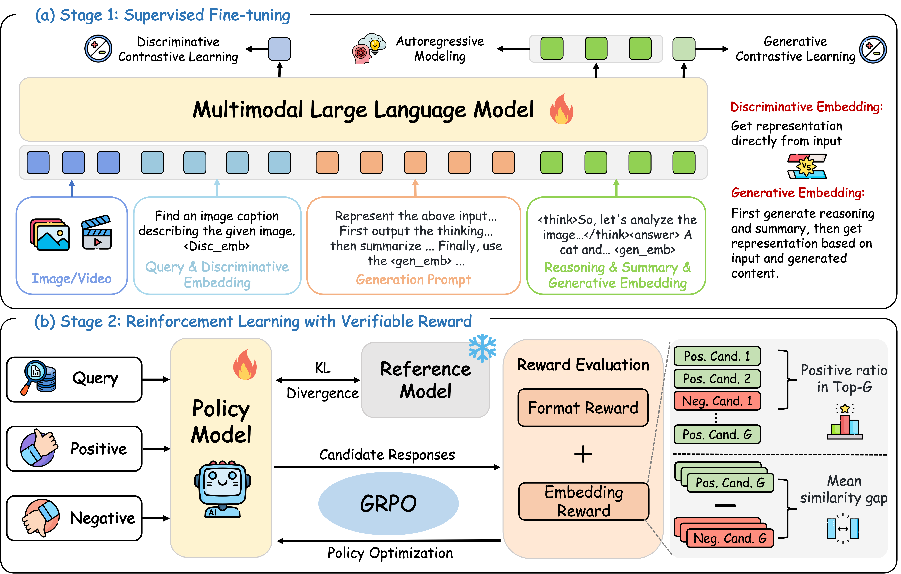
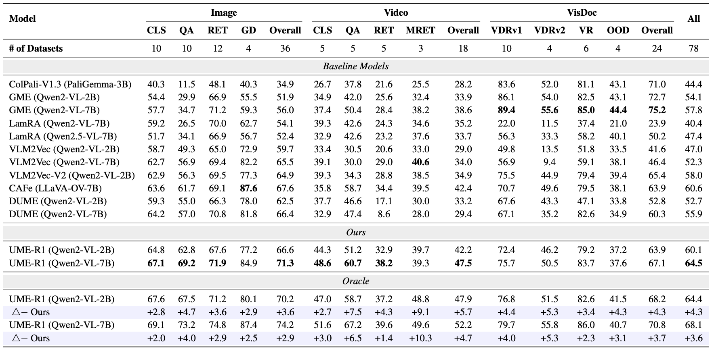
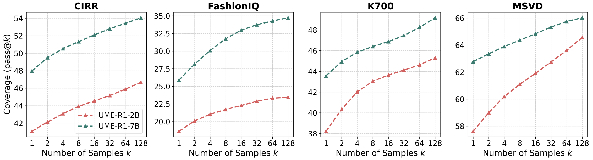

# UME-R1: Exploring Reasoning-Driven Generative Multimodal Embeddings

<font size=4><div align='center' > [[🤗 UME-R1-2B](https://huggingface.co/zhibinlan/UME-R1-2B)] [[🤗 UME-R1-7B](https://huggingface.co/zhibinlan/UME-R1-7B)]  [[🤗 SFT Data](https://huggingface.co/datasets/zhibinlan/UME-sft-train)] [[🤗 RL Data](https://huggingface.co/datasets/zhibinlan/UME-rl-train)] [[📝 arXiv](https://arxiv.org/abs/2511.00405)] </div></font>

This repo contains the code and model for UME-R1: Exploring Reasoning-Driven Generative Multimodal Embeddings, we have developed a series of powerful generative multimodal embedding models that can encode inputs texts, images, and videos. In particular, UME-R1 can generate either discriminative or generative embeddings as needed, and the generative embeddings possess the potential for test-time scaling.



## 🗞️ Release Notes
[2025/11/04] 🚀 We’re thrilled to release the UME-R1 series! The paper, trained models, and code are now open to the community.

## Model Performance
UME-R1 significantly outperforms discriminative embeddings and can provide discriminative or generative representations as needed. Its oracle performance—selecting the best between discriminative and generative—far exceeds using either mode alone.



<!--  -->

In addition, UME-R1 can produce improved embedding representations through repeated sampling, indicating that generative embeddings also hold strong promise for inference-time scaling. 



## 🛠️ Setup

```bash
conda create -n ume-r1 python=3.10
conda activate ume-r1
bash setup.sh
```

## 🚀 Quick Start
Below, we provide simple examples to show how to use UME-R1 with 🤗 Transformers.

Example of obtaining generative embeddings:

```python
from transformers import Qwen2VLForConditionalGeneration,AutoProcessor
from qwen_vl_utils import process_vision_info
import torch

model = Qwen2VLForConditionalGeneration.from_pretrained(
    "zhibinlan/UME-R1-2B",
    torch_dtype=torch.bfloat16,
    attn_implementation="flash_attention_2",
    device_map="cuda:0",
)

processor = AutoProcessor.from_pretrained("zhibinlan/UME-R1-2B")

prompt = '''Represent the above input text, images, videos, or any combination of the three as embeddings. 
First output the thinking process in <think> </think> tags and then summarize the entire input in a word or sentence. 
Finally, use the <gen_emb> tag to represent the entire input.'''


messages = [
    {
        "role": "user",
        "content": [
            {
                "type": "image",
                "image": "assets/example.jpg",
            },
            {"type": "text", "text": "Represent the given image with the following question: What is in the image?\n<disc_emb>\n" + prompt},
        ],
    }
]

# Preparation for inference
text = processor.apply_chat_template(
    messages, tokenize=False, add_generation_prompt=True
)

image_inputs, video_inputs = process_vision_info(messages)
inputs = processor(
    text=[text],
    images=image_inputs,
    videos=video_inputs,
    padding=True,
    return_tensors="pt",
)
inputs = inputs.to(model.device)

# Inference: Generation of the output
generated_output = model.generate(**inputs, max_new_tokens=8192, output_hidden_states=True, return_dict_in_generate=True, use_cache=True)
# Post-process the output
generated_ids = generated_output.sequences
hidden_states = generated_output.hidden_states

generated_ids_trimmed = [
    out_ids[len(in_ids) :] for in_ids, out_ids in zip(inputs.input_ids, generated_ids)
]

def get_embedding_idx(generated_ids_trimmed, EMBEDDING_TOKEN_ID):

    embedding_idx = []
    for i, out_ids in enumerate(generated_ids_trimmed):
        embed_exist = False
        for j in range(len(out_ids) - 1, -1, -1):
            if out_ids[j] == EMBEDDING_TOKEN_ID:
                embedding_idx.append(j + 1)
                embed_exist = True
                break
        if not embed_exist:
            embedding_idx.append(-1)

    return embedding_idx

def normalize_reps(reps):
    reps = torch.nn.functional.normalize(reps, p=2, dim=-1)
    return reps

# Get the last hidden state of the <gen_emb> token
embedding_idx = get_embedding_idx(generated_ids_trimmed, processor.tokenizer.get_vocab()["<gen_emb>"])
embedding_reps = hidden_states[embedding_idx[0]][-1].squeeze(1)

# Normalize the representations
embedding_reps = normalize_reps(embedding_reps)

output_text = processor.batch_decode(
    generated_ids_trimmed, skip_special_tokens=False, clean_up_tokenization_spaces=False
)
```

<details>
<summary>Example of obtaining discriminative embeddings</summary>

```python
from transformers import Qwen2VLForConditionalGeneration,AutoProcessor
from qwen_vl_utils import process_vision_info
import torch

pretrained_path = "release/UME-R1-2B"

# We recommend enabling flash_attention_2 for better acceleration and memory saving, especially in multi-image and video scenarios.
model = Qwen2VLForConditionalGeneration.from_pretrained(
    pretrained_path,
    torch_dtype=torch.bfloat16,
    attn_implementation="flash_attention_2",
    device_map="cuda:0",
)

# default processor
processor = AutoProcessor.from_pretrained(pretrained_path)

messages = [
    {
        "role": "user",
        "content": [
            {
                "type": "image",
                "image": "UME-R1/assets/example.jpg",
            },
            {"type": "text", "text": "Represent the given image with the following question: What is in the image?\n<disc_emb>\n"},
        ],
    }
]

# Preparation for inference
text = processor.apply_chat_template(
    messages, tokenize=False, add_generation_prompt=True
)

image_inputs, video_inputs = process_vision_info(messages)
inputs = processor(
    text=[text],
    images=image_inputs,
    videos=video_inputs,
    padding=True,
    return_tensors="pt",
)
inputs = inputs.to(model.device)

def get_embedding_idx(generated_ids_trimmed, EMBEDDING_TOKEN_ID):

    embedding_idx = []
    # Search from the last token forward
    for i, out_ids in enumerate(generated_ids_trimmed):
        embed_exist = False
        for j in range(len(out_ids) - 1, -1, -1):
            if out_ids[j] == EMBEDDING_TOKEN_ID:
                embedding_idx.append(j)
                embed_exist = True
                break
        if not embed_exist:
            embedding_idx.append(-1)

    return embedding_idx

def normalize_reps(reps):
    # Normalize the representations
    reps = torch.nn.functional.normalize(reps, p=2, dim=-1)
    return reps

output = model(**inputs, output_hidden_states=True, return_dict=True)
hidden_states = output.hidden_states[-1][0]
# print("output.hidden_states shape: ", hidden_states.shape)
embedding_idx = get_embedding_idx(inputs['input_ids'], processor.tokenizer.get_vocab()["<disc_emb>"])

# Get the last hidden state of the <gen_emb> token
embedding_reps = hidden_states[embedding_idx[0]]

# Normalize the representations
embedding_reps = normalize_reps(embedding_reps)
```

</details>

<details>
<summary>Multi image inference</summary>

```python
# Messages containing multiple images and a text query
messages = [
    {
        "role": "user",
        "content": [
            {"type": "image", "image": "file:///path/to/image1.jpg"},
            {"type": "image", "image": "file:///path/to/image2.jpg"},
            {"type": "text", "text": "Represent the given images."},
        ],
    }
]
```

</details>

<details>
<summary>Video inference</summary>

```python
# Messages containing a images list as a video and a text query
messages = [
    {
        "role": "user",
        "content": [
            {
                "type": "video",
                "video": [
                    "file:///path/to/frame1.jpg",
                    "file:///path/to/frame2.jpg",
                    "file:///path/to/frame3.jpg",
                    "file:///path/to/frame4.jpg",
                ],
            },
            {"type": "text", "text": "Represent this video."},
        ],
    }
]

# Messages containing a local video path and a text query
messages = [
    {
        "role": "user",
        "content": [
            {
                "type": "video",
                "video": "file:///path/to/video1.mp4",
                "max_pixels": 360 * 420,
                "fps": 1.0,
            },
            {"type": "text", "text": "Represent this video."},
        ],
    }
]

# Messages containing a video url and a text query
messages = [
    {
        "role": "user",
        "content": [
            {
                "type": "video",
                "video": "https://path/to/video.mp4",
                "min_pixels": 4 * 28 * 28,
                "max_pixels": 256 * 28 * 28,
                "total_pixels": 20480 * 28 * 28,
            },
            {"type": "text", "text": "Represent this video."},
        ],
    }
]
image_inputs, video_inputs, video_kwargs = process_vision_info(messages, return_video_kwargs=True)
inputs = processor(
    text=[text],
    images=image_inputs,
    videos=video_inputs,
    fps=fps,
    padding=True,
    return_tensors="pt",
    **video_kwargs,
)
```

</details>

### More Usage Tips
For more usage tips (including vllm), please refer to [**Qwen-VL**]((https://github.com/QwenLM/Qwen3-VL)). Our model is fully compatible with it, with the only difference being an additional step to obtain the embedding representations.

We also provide several complete examples in the **demo** folder.

## 💪🏻 Training

### 📚 SFT
1. Please refer to [VLM2Vec](https://github.com/TIGER-AI-Lab/VLM2Vec/blob/main/experiments/public/data/download_data.sh) to download the image and video. In addition, please copy the image **UME-R1/assets/blank.jpg** to **MMEB-train/images**. Then, please organize the dataset in the following directory structure before training:

```bash
MMEB-train/
├── images/ # MMEB-V1
    ├── blank.jpg # copy from UME-R1/assets/blank.jpg
├── llavahound/
├── vidore/
└── visrag/
```

2. Download our released JSON dataset containing CoT annotations:

```bash
git clone https://huggingface.co/datasets/zhibinlan/UME-sft-train
```

3. define the dataset path in `UME-R1/src/sft-train/qwenvl/data/__init__.py`
```python
MMEB_V2_GROUP = {
    "annotation_path": "/data/your_dataset/UME-sft-train.json",
    "data_path": "/data/your_dataset/MMEB-train/",
}
```
4. Run the following command to train the SFT model.
```bash
export prefix=your_path
export llm=Qwen/Qwen2-VL-2B-Instruct
export run_name=UME-2B

# DeepSpeed configuration
deepspeed=$prefix/UME-R1/src/sft-train/scripts/zero3.json

# Training hyperparameters
lr=5e-5
batch_size=4
grad_accum_steps=4

# Training entry point
entry_file=$prefix/UME-R1/src/sft-train/qwenvl/train/train_qwen.py

# Dataset configuration (replace with public dataset names)
datasets=mmeb_v2_group

# Output configuration
output_dir=$prefix/output/$run_name

# Training arguments
args="
    --deepspeed ${deepspeed} \
    --model_name_or_path "${llm}" \
    --dataset_use ${datasets} \
    --data_flatten False \
    --tune_mm_vision False \
    --tune_mm_mlp True \
    --tune_mm_llm True \
    --output_dir ${output_dir} \
    --max_steps 5000 \
    --data_group True \
    --bf16 \
    --per_device_train_batch_size ${batch_size} \
    --per_device_eval_batch_size $((batch_size*2)) \
    --gradient_accumulation_steps ${grad_accum_steps} \
    --max_pixels 2359296 \
    --min_pixels 768 \
    --eval_strategy "no" \
    --save_strategy "steps" \
    --save_steps 500 \
    --save_total_limit 10 \
    --learning_rate ${lr} \
    --weight_decay 0 \
    --warmup_ratio 0.03 \
    --max_grad_norm 1 \
    --lr_scheduler_type "cosine" \
    --logging_steps 1 \
    --model_max_length 12288 \
    --gradient_checkpointing True \
    --dataloader_num_workers 4 \
    --run_name ${run_name} \
    --report_to none"

# Launch training
torchrun --node_rank=$RANK \
         --nnodes=8 \
         --nproc_per_node=8 \
         --master_addr=${MASTER_ADDR} \
         --master_port=${MASTER_PORT} \
         ${entry_file} ${args} \
        >>$prefix/log/$run_name.log 2>&1
```

### 📚 GRPO

1. Download our released JSON dataset:
```bash
git clone https://huggingface.co/datasets/zhibinlan/UME-rl-train
```

2. Write the path of the annotation files in the `UME-R1/src/r1-train/data_config/embed.yaml` file.
```bash
datasets:
    - json_path: /path/to/UME-rl-train.json
```

3. Run the following command to train the RL model.

> [!NOTE] 
> If you encounter 'CUDA out of memory' error, you can try to reduce the `per_device_train_batch_size`.

```bash
export prefix=your_path
export MODEL_NAME=UME-2B
export RUN_NAME=UME-R1-2B
torchrun --node_rank=${RANK} \
    --nproc_per_node=8 \
    --nnodes=8 \
    --master_addr=${MASTER_ADDR} \
    --master_port=${MASTER_PORT} \
    $prefix/UME-R1/src/r1-train/src/open_r1/grpo_embed.py \
    --deepspeed $prefix/UME-R1/src/r1-train/local_scripts/zero3.json \
    --output_dir $prefix/output/$RUN_NAME \
    --model_name_or_path $MODEL_NAME \
    --dataset_name $prefix/UME-R1/src/r1-train/data_config/embed.yaml \
    --image_root "/path/to/MMEB-train" \
    --max_prompt_length 1024 \
    --max_completion_length 2048 \
    --beta 0.04 \
    --epsilon_high 0.28 \
    --learning_rate 1e-6 \
    --num_generations 8 \
    --temperature 1 \
    --per_device_train_batch_size 2 \
    --gradient_accumulation_steps 2 \
    --logging_steps 1 \
    --bf16 \
    --torch_dtype bfloat16 \
    --data_seed 42 \
    --report_to none \
    --gradient_checkpointing true \
    --attn_implementation flash_attention_2 \
    --num_train_epochs 1 \
    --run_name $RUN_NAME \
    --max_pixels 2359296 \
    --save_steps 50 \
    --save_only_model true \
    >>$prefix/log/$RUN_NAME.log 2>&1
```

## 📊 Evaluation


1. Please refer to `UME-R1/src/eval/VLM2Vec/experiments/public/data/download_data.sh` to download the image and video.

2. Run the following command to eval the model.


```bash
export prefix=your_path

cd $prefix/UME-R1/src/eval/VLM2Vec || exit

# ==============================================================================
# Configuration
# ==============================================================================
CUDA_VISIBLE_DEVICES="0,1,2,3,4,5,6,7"
# BATCH_SIZE=4
MODALITIES=("image" "video" "visdoc")


declare -A BATCH_SIZES
BATCH_SIZES=( ["visdoc"]=4 ["video"]=2 ["image"]=4 )

MODE="gen"  # gen or disc

DATA_BASEDIR="$prefix/data/MMEB-V2" 
OUTPUT_BASEDIR="$prefix/mmeb-output-v2/"

RUN_NAME="zhibinlan/UME-R1-2B"

# ==> Define models and their base output paths here
# Format: "MODEL_NAME;BASE_OUTPUT_PATH"
declare -a MODEL_SPECS
MODEL_SPECS+=( "$prefix/output/$RUN_NAME;qwen2_vl;$OUTPUT_BASEDIR/$RUN_NAME" )


# ==============================================================================
# Main Execution Loop
# ==============================================================================
# Loop through each model specification
for spec in "${MODEL_SPECS[@]}"; do
  # Parse the model name and base output path from the spec string
  IFS=';' read -r MODEL_NAME MODEL_BACKBONE BASE_OUTPUT_PATH <<< "$spec"

  echo "================================================="
  echo "🚀 Processing Model: $MODEL_NAME"
  echo "================================================="

  # Loop through each modality for the current model
  for MODALITY in "${MODALITIES[@]}"; do
    DATA_CONFIG_PATH="$prefix/UME-R1/src/eval/VLM2Vec/experiments/public/eval/$MODALITY.yaml"
    OUTPUT_PATH="$BASE_OUTPUT_PATH/$MODALITY/"
    BATCH_SIZE=${BATCH_SIZES[$MODALITY]} 
    echo "-------------------------------------------------"
    echo "  - Modality: $MODALITY"
    echo "  - Output Path: $OUTPUT_PATH"
    echo "  - Batch Size: $BATCH_SIZE"

    # Ensure the output directory exists
    mkdir -p $OUTPUT_PATH
    echo "  - Executing command..."

    torchrun --node_rank=$RANK \
      --nnodes=1 \
      --nproc_per_node=8 \
      --master_addr=${MASTER_ADDR} \
      --master_port=${MASTER_PORT} \
      eval_twomode.py \
      --per_device_eval_batch_size $BATCH_SIZE \
      --model_backbone $MODEL_BACKBONE \
      --model_name $MODEL_NAME \
      --dataset_config $DATA_CONFIG_PATH \
      --encode_output_path $OUTPUT_PATH \
      --data_basedir $DATA_BASEDIR \
      --max_new_tokens 8192 \
      --resize_max_pixels 2359296 \
      --resize_min_pixels 784 \
      --qry_mode $MODE \
      --tgt_mode $MODE \
      >>$prefix/eval_log/${RUN_NAME}_{$MODE}_v2.log 2>&1

    echo "  - Done."
    echo "-------------------------------------------------"
  done
done

echo "✅ All jobs completed."
```


## 🤝 Acknowledgements

We would like to express our sincere gratitude to [VLM-R1](https://github.com/om-ai-lab/VLM-R1), [QwenVL](https://github.com/QwenLM/Qwen3-VL), and [VLM2Vec](https://github.com/TIGER-AI-Lab/VLM2Vec) for providing open-source resources that contributed to the development of this project.


## Citation
If you find our work useful, please consider citing it.
```
@article{lan2025ume,
  title={UME-R1: Exploring Reasoning-Driven Generative Multimodal Embeddings},
  author={Lan, Zhibin and Niu, Liqiang and Meng, Fandong and Zhou, Jie and Su, Jinsong},
  journal={arXiv preprint arXiv:2511.00405},
  year={2025}
}
```